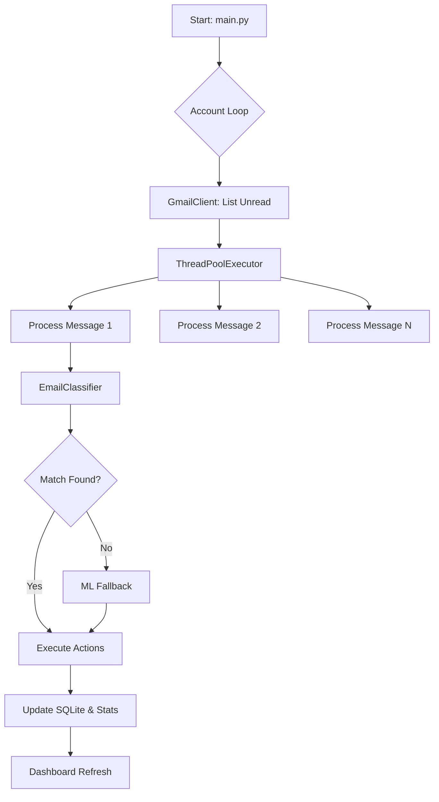
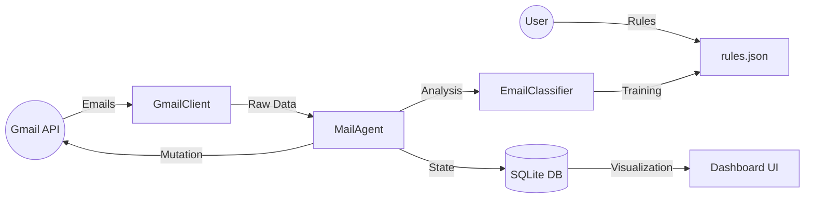

# 🤖 Autonomous AI Mail Agent (GODMODE Edition)

[](https://en.wikipedia.org/wiki/Free_and_open-source_software)
[](https://www.python.org/downloads/)
[](https://www.docker.com/)

> **"Organize the chaos, autonomously. No compromises, 100% FOSS."**
> *Status: /DEEPDIVE /ULTRATHINK /10X /GODMODE*

---

## ⚡ TL;DR (Too Long; Didn't Read)
An industrial-grade, multi-threaded AI agent that manages multiple Gmail accounts. It classifies emails using Regex + ML (Naive Bayes), executes automated actions (trash, label, reply, forward, etc.), and provides a real-time analytics dashboard.

---

## 🧸 ELI5 (Explain Like I'm Five)
Imagine you have a super-smart robot assistant for your email. Every time you get a new message, the robot looks at it, decides if it's junk, work, or a friend, and then puts it in the right folder, marks it as read, or even forwards it to someone else. It does this all day, every day, so you never have to see a messy inbox again!

---

## 🛠️ Pre-Requisites (Pre-Requestees)
Before descending into the abyss of automation, ensure you have:
1.  **Python 3.10+**: The core runtime environment.
2.  **Google Cloud Project**:
    *   Enabled **Gmail API**.
    *   OAuth 2.0 Credentials (`credentials.json`).
    *   Configured "External" user type (if testing).
3.  **Docker & Docker Compose** (Optional, but recommended for production isolation).
4.  **Local LLM (Ollama)** (Optional, for advanced n8n orchestration integration).

---

## ⚙️ Installation & Setup

### 1. Clone & Environment
```bash
git clone https://github.com/your-repo/mailagent.git
cd mailagent
python3 -m venv venv
source venv/bin/activate
pip install -r requirements.txt
```

### 2. Google API Auth (The "First Pulse")
1.  Go to [Google Cloud Console](https://console.cloud.google.com/).
2.  Create a project -> **APIs & Services** -> **Library** -> Enable **Gmail API**.
3.  **OAuth Consent Screen**: Set user type to "External" and add yourself as a test user.
4.  **Credentials**: Create "OAuth Client ID" (Desktop App) -> Download and rename to `credentials.json`.
5.  Place `credentials.json` in the project root.

---

## 🌑 Configuration Deep-Dive

### Environment Variables (`.env`)
Create a `.env` file in the root directory:
| Variable | Description | Default |
| :--- | :--- | :--- |
| `GMAIL_ACCOUNTS` | JSON list of account creds/tokens | `[{"credentials": "credentials.json", "token": "token.json"}]` |
| `CHECK_INTERVAL` | Seconds between inbox sweeps | `1800` |
| `MAX_WORKERS` | Threads for parallel processing | `10` |
| `DRY_RUN` | Log actions without executing on Gmail | `False` |
| `DASHBOARD_ENABLED` | Toggle the web dashboard | `True` |
| `DASHBOARD_PORT` | Port for the Flask UI | `5000` |
| `LOG_FORMAT` | `text` or `json` (for ELK/Prometheus) | `text` |

### Rules Engine (`rules.json`)
The brain of the agent. Patterns are **Case-Insensitive Regex**.
```json
{
  "WORK": {
    "patterns": ["project", "deadline", "meeting"],
    "header_rules": [{"name": "from", "pattern": "boss@corp.com"}],
    "actions": ["label", "mark_important", "star"]
  },
  "SPAM": {
    "patterns": ["lottery", "win.*prize", "crypto giveaway"],
    "actions": ["trash"]
  }
}
```

---

## 🧠 Working Principle (The Feynman Technique)

### The Core Logic: "Observe, Orient, Decide, Act" (OODA)
The agent operates on a continuous loop, treating the inbox as a state machine:

1.  **Observe (Discovery)**: The `GmailClient` polls for `is:unread` messages. It handles pagination automatically to ensure 100% coverage.
2.  **Orient (Analysis)**: The `EmailClassifier` extracts multi-dimensional features: `Subject`, `From`, `Snippet`, and the full `body_text`.
3.  **Decide (Classification)**:
    *   *Phase 1*: **Deterministic**. It runs compiled Regex rules. If a match is found, it's final.
    *   *Phase 2*: **Probabilistic**. If Regex fails, a Naive Bayes ML model (Scikit-Learn) predicts the category based on historical patterns in your rules.
4.  **Act (Execution)**: The `MailAgent` uses a `ThreadPoolExecutor` to perform actions (move to trash, apply labels, forward, reply) in parallel, maximizing throughput.

---

## 💎 First Principles: Why this works?
At its core, email management is a **Classification + Action** problem. Most systems fail because they are either too rigid (Regex only) or too opaque (LLM only). We solve this by:
-   **Hybrid Intelligence**: Combining the precision of Regex with the flexibility of Naive Bayes.
-   **Parallelism**: Email volume is a bottleneck; multi-threading is the cure.
-   **Idempotency**: A database ensures we never repeat ourselves, even in chaos.

---

## 📊 System Architecture & Data Flow

### 🔄 High-Level Flow Chart (System Design)


### 💾 Data Flow Diagram (DFD)


---

## 🚀 Execution & Deployment

### Direct CLI Execution
```bash
# Standard Run
python3 main.py

# Debug Mode (Dry Run)
DRY_RUN=True python3 main.py
```

### Docker Deployment (10X Scalability)
```bash
# Build and start in background
docker-compose up --build -d

# View logs
docker-compose logs -f
```

### Headless/Server Authentication
In environments without a GUI, you cannot perform the browser OAuth flow.
**Solution**: Perform auth locally, then copy the `token.json` content to an environment variable:
*   `GMAIL_TOKEN_TOKEN_JSON='{"token": "...", "refresh_token": "..."}'`

---

## 🏛️ Multi-Team Orchestration (The "CEO" Perspective)
The project includes `src/orchestrator.py`, a simulation of a hierarchical team structure:
*   **CEO**: Defines the vision and long-term 9-step improvement loop.
*   **Project Manager**: Allocates resources and manages team leaders.
*   **Team Leaders**: Divide tasks among agents and sub-agents.
*   **Agents**: Perform the actual "work" of fixing gaps and enhancing the codebase.

This reflects the project's philosophy of **Continuous Improvement**.

---

## 📐 Design Patterns & Principles
*   **Singleton/Thread-Local**: `GmailClient` uses thread-local storage for API service objects.
*   **Idempotency**: Uses composite primary keys `(message_id, account_email)` to prevent re-processing.
*   **Strategy Pattern**: Classification logic is decoupled from action execution.
*   **Graceful Degradation**: Fallback to `MockGmailClient` in dry-run if credentials are missing.

---

## ⚖️ Pros & Cons (The "Devil's Advocate")

| Pros (Steel-man) | Cons (Critique) |
| :--- | :--- |
| **100% FOSS**: No hidden costs. | **Setup Friction**: High initial effort for Google API. |
| **Parallelism**: Blazing fast. | **Memory Usage**: Python threads can be heavy on low-end VMs. |
| **ML Fallback**: Robust to rule gaps. | **Cold Start**: ML model needs enough rules to be accurate. |
| **Atomic Actions**: No partial states. | **Single Node**: SQLite isn't distributed. |

---

## ✅ Deployment Checklist
- [ ] `credentials.json` placed in root.
- [ ] `rules.json` contains at least one category.
- [ ] `.env` file configured with `GMAIL_ACCOUNTS`.
- [ ] Port `5000` available for Dashboard.
- [ ] (Optional) `token.json` generated via first run.

---

## 📅 Roadmap & Future Vision
- [ ] **Vector Embeddings**: Semantic classification via ChromaDB.
- [ ] **Plugin Architecture**: Third-party Action Plugins.
- [ ] **WebUI Management**: Edit rules from the dashboard.

---

## 🕵️ Troubleshooting (Autopsy)
1.  **"Invalid Credentials"**: Check Google Cloud "Publishing Status".
2.  **"Database Locked"**: Ensure only one instance is running.
3.  **"Quota Exceeded"**: Increase `CHECK_INTERVAL` or decrease `MAX_WORKERS`.

---

> "The best way to predict the future is to automate it." — *Autonomous Mail Agent Team*
